# Guitar-to-MIDI TinyML (EE446 Final Project)

A real-time guitar-to-MIDI converter that runs entirely on an ESP32-S3: a small dual-head
convolutional network listens to a guitar through a microphone (or line-in), detects note
pitch and note onsets on-device, and streams the result out as USB-MIDI. No host computer,
cloud inference, or external DSP box is involved -- the whole pipeline, from analog audio to
MIDI bytes, runs on one microcontroller.

## How the pieces fit together

```mermaid
flowchart LR
    subgraph offline["Offline -- train_guitar_midi.ipynb (this repo, run on a PC)"]
        A[GuitarSet dataset\nsolo recordings + JAMS annotations] --> B[Windowing + labeling\n128ms windows, 10ms hop]
        B --> C[Dual-head DS-CNN\nnote softmax + onset sigmoid]
        C --> D[Quantization-aware training\nINT8, checkpoint-verified]
        D --> E["model.h + class_labels.h\n(exported C headers)"]
    end

    subgraph device["On-device -- guitar_midi_esp32s3.ino (ESP32-S3)"]
        F[INMP441 mic\nor Pmod I2S2 line-in] --> G[I2S DMA\n10ms hops]
        G --> H[Sliding 128ms window]
        H --> I[TFLite Micro\nInvoke on esp-nn]
        I --> J[Note state machine\nonset-triggered, timestamp-driven]
        J --> K[USB-MIDI\nNote On / Note Off]
    end

    E -. "copied into the sketch folder\nbefore compiling" .-> device
    K --> L[DAW / synth\nany class-compliant USB-MIDI host]
```



The notebook and the firmware are two halves of one system that must never drift apart:
window size, hop size, the normalization formula, the onset band width, and the onset
decision threshold are all decided in the notebook and exported into `class_labels.h`, which
the firmware includes and checks against at compile time. There is exactly one place each of
those constants is defined.

## Repository structure

| File | What it is |
|---|---|
| `train_guitar_midi.ipynb` | The full training pipeline: dataset loading, labeling, model definition, training, INT8 quantization (with a verification checkpoint ladder), and C header export. Run this first, on a PC with the GuitarSet dataset available. |
| `guitar_midi_esp32s3.ino` | The ESP32-S3 firmware. Reads audio over I2S, runs the exported model with TFLite Micro, and emits USB-MIDI. Needs `model.h` and `class_labels.h` (below) copied alongside it before it will compile. |
| `requirements.txt` | Python dependencies for the notebook. |
| `model.h` *(generated)* | The trained, quantized model as a C byte array. Produced by the notebook's last section; not checked in, since it's a build artifact of the dataset + notebook. |
| `class_labels.h` *(generated)* | Every constant the firmware needs to agree with the notebook on (window/hop size, sample rate, normalization floor, onset band width, onset threshold, and the class-index -> MIDI-note table). Produced alongside `model.h`. |
| `esp-dev-kits-en-master-esp32s3.pdf` | Espressif's ESP32-S3 dev-kit reference (board pinouts, power, USB modes). |
| `pmodi2s2.pdf` | Digilent's Pmod I2S2 reference manual, for the line-in wiring option. |

`model.h` and `class_labels.h` are build outputs, not source: run the notebook against your
own copy of GuitarSet to produce them, then copy both files into the same folder as
`guitar_midi_esp32s3.ino` before opening the sketch in the Arduino IDE.

## The model

A MobileNet-style depthwise-separable CNN over raw 16 kHz PCM (no hand-engineered features,
no FFT/mel front end in either the notebook or the firmware). One shared trunk feeds two
heads:

- **Note head** -- softmax over a data-derived MIDI vocabulary (silence + the pitch range
  actually present in the training corpus), predicting which pitch is sounding at the end of
  each 128 ms analysis window.
- **Onset head** -- a single sigmoid predicting whether a real note attack occurred within
  the last ~60 ms of the window.

The trunk uses `Conv2D`/`DepthwiseConv2D` (not their 1D equivalents) specifically so that
quantization-aware training is available -- `tensorflow_model_optimization` has no quantized
op registered for `DepthwiseConv1D`. Model width and the stem's stride are sized so the whole
network costs about 1.4 million multiply-accumulates per window, which fits comfortably
inside the ESP32-S3's real-time inference budget (see the "model capacity vs. inference
budget" section of the notebook for the actual sweep this was chosen from).

Deployment is via INT8 quantization-aware training rather than plain post-training
quantization: the notebook runs both, plus a float32 and dynamic-range checkpoint, and
compares all four so any accuracy cost from quantization is measured rather than assumed.

## The firmware

The ESP32-S3 splits work across its two cores: one core services the I2S microphone/ADC and
runs the note timing state machine, the other runs the TFLite Micro `Invoke()` call as fast as
it can. Every timing decision -- when a note starts, when it releases, how long to wait before
allowing a repeat -- is made against microsecond timestamps carried alongside the audio, not
against an assumed frame count, so the state machine stays correct regardless of exactly how
fast the model runs. The firmware also measures and prints its own inference time continuously
(the `[HEALTH]` serial line), which is the first thing to check if playing feels laggy or notes
go missing.

Note On fires directly on the onset prediction rather than behind a stability-count delay, so
latency is small and -- more importantly -- constant from note to note, which is what makes
timing feel right to a DAW's track-delay compensation. Two independent safety nets (an
RMS-based release and a hard duration ceiling) guarantee every Note On eventually gets a Note
Off even if the note head itself never predicts silence.

## Hardware

Any ESP32-S3 board with native USB (USB-OTG) pins exposed works (most
"ESP32-S3-DevKitC-1"-style boards qualify). Two audio input options, selected at compile time
via `AUDIO_SOURCE` in the firmware -- both can be wired at once:

**Option A -- INMP441 I2S MEMS microphone** (onboard listening)

| INMP441 pin | ESP32-S3 pin |
|---|---|
| SCK | GPIO 4 |
| WS | GPIO 5 |
| SD | GPIO 6 |
| L/R | GND (mono) |
| VDD / GND | 3V3 / GND |

**Option B -- Digilent Pmod I2S2 line-in** (3.5mm jack, CS5343 ADC; see `pmodi2s2.pdf`)

Only the Pmod's bottom row (the A/D / line-in side) is wired -- the top row drives line-out
and carries no signal this firmware could read.

| Pmod I2S2 pin | Signal | ESP32-S3 pin |
|---|---|---|
| 7 | A/D MCLK (required) | GPIO 15 |
| 8 | A/D LRCK | GPIO 17 |
| 9 | A/D SCLK | GPIO 16 |
| 10 | A/D SDOUT | GPIO 18 |
| 11 / 12 | GND / VCC | GND / 3V3 |

See `esp-dev-kits-en-master-esp32s3.pdf` for the dev-kit's own pinout and power/USB-mode
jumpers, and the top-of-file comment in `guitar_midi_esp32s3.ino` for the same wiring in
context.

## Running it end to end

1. **Train.**
   ```
   pip install -r requirements.txt
   jupyter lab train_guitar_midi.ipynb
   ```
   Point `GUITARSET_DIR` (in the notebook's CONFIG cell) at a local copy of
   [GuitarSet](https://guitarset.weebly.com/) containing `audio_mono-mic/` and `annotation/`,
   then run the notebook top to bottom. This trains the model, quantizes it, verifies accuracy
   at every quantization stage, and writes `model.h` + `class_labels.h` into `./artifacts/`.

2. **Wire the hardware** per the tables above, and set `AUDIO_SOURCE` at the top of
   `guitar_midi_esp32s3.ino` to match.

3. **Assemble the sketch folder.** Copy `model.h` and `class_labels.h` from the notebook's
   `artifacts/` directory into the same folder as `guitar_midi_esp32s3.ino`.

4. **Flash.** Open `guitar_midi_esp32s3.ino` in the Arduino IDE with an ESP32-S3 board
   selected, USB Mode set to "USB-OTG (TinyUSB)", and arduino-esp32 core >= 3.0 installed (it
   ships `esp-tflite-micro` and `esp-nn` prebuilt -- no separate TensorFlow Lite library
   install is needed, and none should be installed alongside it). Flash the board.

5. **Play.** Open the Serial Monitor at 115200 baud to watch the boot banner and the periodic
   `[HEALTH]`/`[NOTE ON]`/`[NOTE OFF]` lines, and connect the board as a USB-MIDI device to any
   DAW or standalone synth.

## Known limitations

- **The training/validation split holds out one full player**, per GuitarSet's own recommended
  protocol, so reported accuracy reflects generalization to an unseen guitarist rather than
  just an unseen recording.
- **The onset band width (`ONSET_WINDOW_MS`) sets a hard ceiling on playable note-repeat
  speed** (`RETRIGGER_LOCKOUT_MS` in the firmware) -- widening it for more timing margin trades
  directly against how fast repeated notes on the same pitch can be played.
- **Velocity comes from a linear RMS-to-velocity mapping**, not from the model; a very quiet
  playing setup will compress the usable velocity range and may need the input gain constants
  in the firmware (`MIC_SHIFT_TO_INT16` / `PMOD_SHIFT_TO_INT16`) retuned.
- **The note head is monophonic by construction** (a single softmax over one pitch at a time),
  matching GuitarSet's solo takes; chords or double-stops are not a supported input.

## Dataset attribution

Trained on [GuitarSet](https://guitarset.weebly.com/) (Q. Xi, R. M. Bittner, J. Pauwels, X. Ye,
J. P. Bello, "GuitarSet: A Dataset for Guitar Transcription", ISMIR 2018), used under its
original license. GuitarSet is not redistributed in this repository -- point the notebook's
`GUITARSET_DIR` at your own local copy.
